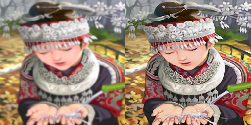
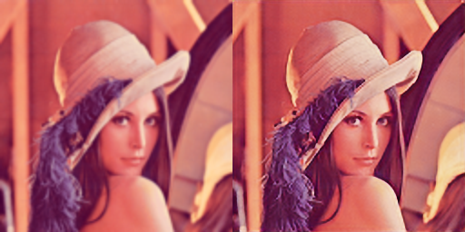

# SuperRes-GAN
**Fifth Semester mini project.Video Super Resolution using Deep Convolutional Generative Adversarial Network(DCGAN).**

A Generative Adversarial Network has two main Neural Networks.
* Generator
* Discriminator

## Generator

The Generator takes a low resolution(LR) image as input and tries to generate a high resolution(HR) image for that input.
## Discriminator

The Discriminator learns from the actual training data and also the gererated results of the Generator and tries to distinguish real and generated images.

## Instructions for Usage
Prepare train and test npy files
```
python3 prepare.py
```
Train the model
```
python3 train.py
```

## Working of the Model
As the training goes the generator gets better and better at generating realistic outputs while the discriminator finds it harder and harder to distingush real and fake images. 

Here are some of the results of super resolution on images from our testing dataset:
Left image is super resolution using bilinear interpolation and Right image is the output of our GAN

|  | 
|:--:| 

| | 
|:--:| 

| | 
|:--:| 


## Datasets
### Training Dataset
We used The Validation Set from ILSVRC2012(Image Recognition Challenge).This Set Contains 50000 randomly selected Images from Imagenet dataset.We are only using 10000 of these images for our model.You can find the dataset [here](http://www.image-net.org/challenges/LSVRC/2012/nnoupb/ILSVRC2012_img_val.tar).

### Testing Dataset
Our Testing dataset contains images from various datasets like Set5, Set14, BSDS100, Urban100, Manga109, Historical.The files can be found [here](http://vllab.ucmerced.edu/wlai24/LapSRN/results/SR_testing_datasets.zip)


